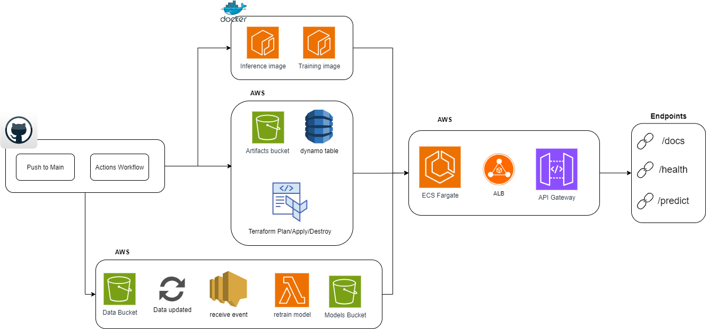

# 🧠 Property Price Predictor – Full MLOps Pipeline (AWS + Terraform + Docker + GitHub Actions)

<p align="center">
  
  
  
  
  
</p>

---

## 📋 Overview

This project implements a **fully automated MLOps pipeline** responsible for training, retraining, and serving Machine Learning models on **AWS**, combining:

- **S3 + SNS + Lambda** → event-driven training/retraining automation  
- **ECR + ECS Fargate** → containerized inference API hosting  
- **Terraform** → full infrastructure provisioning (IaC)  
- **GitHub Actions** → CI/CD, build, and deploy automation  
- **FastAPI** → model inference serving with built-in OpenAPI documentation  

The model predicts **real estate prices** based on property type, area, location, and room count, using a `GradientBoostingRegressor` (Scikit-Learn).

---

## ⚙️ Solution Architecture

<p align="center">
  
</p>

---

## 🧩 End-to-End Workflow

1️⃣ **Data ingestion**  
   - New data uploaded to the S3 bucket automatically triggers an event.

2️⃣ **Event trigger (SNS + Lambda)**  
   - The event is published via **SNS**, which triggers the **Lambda Trainer** function.

3️⃣ **Lambda Trainer (train/retrain)**  
   - The Lambda consumes the event, processes the dataset, and executes model training.  
   - The new artifact is saved to `s3://<artifacts-bucket>/models/latest/model.joblib`.

4️⃣ **Inference API (ECS + FastAPI)**  
   - The container hosted on **ECS Fargate** exposes `/predict`, `/health`, `/docs`, and `/openapi.json`.  
   - The API authenticates via API Key and uses smart caching — it checks if the cached model is up to date and reloads only if a newer version exists.

5️⃣ **CI/CD & Infrastructure (Terraform + GitHub Actions)**  
   - On every push to `main`:  
     - Docker images for training and inference are built and pushed to ECR,  
     - `terraform plan` and `apply` (or `destroy`) are executed,  
     - the full infrastructure is deployed and endpoints are outputed.

---

## 🧱 Folder Structure

```
.
├── .github/workflows/deploy.yml
├── config/pipeline_config.yml
├── docs/arquitetura.png
├── infra/
│   ├── alb.tf
│   ├── apigw_ecs_proxy.tf
│   ├── backend.tf
│   ├── ecs.tf
│   ├── iam.tf
│   ├── lambda.tf
│   ├── main.tf
│   ├── network.tf
│   ├── outputs.tf
│   ├── s3.tf
│   ├── security_groups.tf
│   └── variables.tf
├── src/
│   ├── inference/
│   │   ├── Dockerfile
│   │   ├── predict.py
│   │   └── requirements.txt
│   └── training/
│       ├── Dockerfile
│       ├── requirements.txt
│       └── training.py
└── README.md
```

---

## 🔁 Automatic Retraining Flow

| Event | Action | Result |
|--------|---------|----------|
| New CSV uploaded to S3 | SNS publishes notification | Lambda is triggered |
| Lambda runs `train.py` | Trains & evaluates model | Saves updated `model.joblib` to S3 |
| ECS API detects new model | Updates local cache | Serves predictions using the latest model |

---

## 🧠 Inference API

| Method | Route | Description |
|---------|-------|-------------|
| `POST` | `/predict` | Predicts price based on input features |
| `GET` | `/health` | API status and model info |
| `GET` | `/docs` | Auto-generated Documentation |
| `GET` | `/openapi.json` | OpenAPI schema |

### Example request

```bash
curl -X POST "https://<api_id>.execute-api.us-east-2.amazonaws.com/prod/predict"   -H "Content-Type: application/json"   -H "x-api-key: <api_key>"   -d '{
    "type": "house",
    "sector": "las condes",
    "net_usable_area": 110.0,
    "net_area": 200.0,
    "n_rooms": 3,
    "n_bathroom": 3,
    "latitude": -33.3932,
    "longitude": -70.5505
  }'
```

---

## ⚙️ Requirements

| Tool | Minimum Version | Purpose |
|-------|------------------|----------|
| Terraform | ≥ 1.6 | Infrastructure provisioning |
| AWS CLI | ≥ 2.15 | AWS interaction |
| Docker | ≥ 24.0 | Build images |
| Python | ≥ 3.10 | Training scripts |
| GitHub Actions | Built-in | CI/CD |

---

## 🔑 Required Configurations

### 🔐 GitHub Secrets

| Name | Description |
|------|--------------|
| `AWS_ACCESS_KEY_ID` | AWS access key |
| `AWS_SECRET_ACCESS_KEY` | AWS secret key |
| `AWS_REGION` | AWS region |

---

## 🧱 Remote Terraform Backend

Create the following resources on AWS:

- **S3 Terraform Bucket** → stores `terraform.tfstate`  
- **S3 Data Bucket** → where your data for training is stored
- **DynamoDB Table** → manages Terraform state locks  

```hcl
terraform {
  backend "s3" {
    bucket         = BUCKET_NAME
    key            = "terraform/state.tfstate"
    region         = var.aws_region
    dynamodb_table = DYNAMO_TABLE_NAME
    encrypt        = true
  }
}
```

Set variables in your `.tfvars` file matching `variables.tf`.

---

## ⚙️ Workflow Config (GitHub Actions)

File: `config/pipeline_config.yml`

| Key | Description |
|------|--------------|
| `aws_account_id` | AWS account ID |
| `aws_region` | AWS region |
| `ecr_training_repo` | ECR repository for lambda training image |
| `ecr_inference_repo` | ECR repository for ECS inference image |
| `terraform_state_bucket` | S3 bucket for Terraform state |
| `terraform_lock_table` | DynamoDB table for Terraform locks |
| `project_name` | Project name |
| `action` | Terraform action: `apply` or `destroy` |

---

## ✨ Author

Developed by **Thaís Guimarães (thagmrs)** 🦫  
💼 ML & Data Engineering  
🔗 [linkedin.com/in/thaisgmrs](https://linkedin.com/in/thaisgmrs)

---

## 🔮 Future Enhancements

- Add a data validation step before training  
- Make data ingestion source-agnostic (as long as required columns exist)  
- Implement model versioning (e.g., MLflow or Model Registry)  
- Log model metrics and retrain only if performance degrades  
- Migrate training to AWS Batch or other scalable compute services  
- Replace API Key with Cognito Authorizer  
- Create `staging` and `prod` environments via Terraform workspaces  
- Enhance GitHub Actions workflow with tests and multi-step validation  
